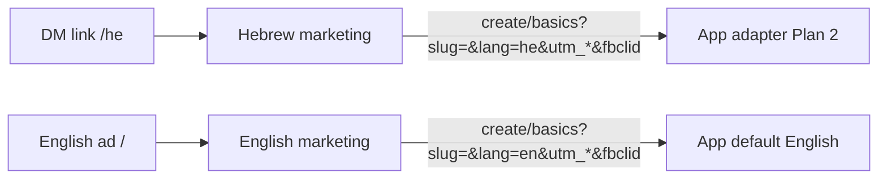

# Marketing i18n (English + Hebrew)

## Recommendation: two plans

**This plan is marketing-site only** (`onetap-marketing-v2`). Language will not stick in the app until `onetap-app` reads `?lang=he` — that work does not exist today (cookie `onetap-locale` only; no URL locale). Do it in a **second plan chat** so each repo stays reviewable.

You already chose:
- Hebrew URLs as `/he`, `/he/pricing`, `/he/blog/...` — **no geo redirect**
- English stays at current URLs (`/`, `/pricing`, …) so SEO does not break
- Full site in Hebrew, including all 18 blog posts

Share in DMs: `https://onetap-card.com/he` (plus any UTMs).

---

## Why `/he` and not `?lang=he` on the marketing site

Query-only language is weaker for a public marketing site: duplicate-content risk, uglier DM links, harder `hreflang`. Path prefix is the fitted practice. The **app** still gets `?lang=he` on outbound CTAs because the app has no locale routes (cookie-based chrome i18n).



---

## What already works (do not rebuild)

- **Slug → onboarding handle:** homepage `SlugClaimCta` already sends `?slug=` via [`buildCreateBasicsUrl`](src/lib/constants.ts). The app already prefills the wizard slug ([`useWizardSlugFromUrl`](file:///Users/ofirkaspi/LevelUp/onetap/onetap-app/src/hooks/useWizardSlugFromUrl.ts)).
- **UTMs + fbclid:** [`appendAttributionParams`](src/lib/constants.ts) already copies `fbclid`, `utm_source`, `utm_medium`, `utm_campaign`, `utm_content`, `utm_term`. The app already captures them.

**Assumption on “db id”:** there is no `db_id` (or similar) in either repo. We will **not** forward every query param (open-ended forwarding leaks junk and is harder to sanitize). We keep an allowlist and add `lang`. If you have a specific extra key, name it and we add it to both allowlists.

**Assumption on “the name”:** this is the hero slug input, which already prefills the **card URL handle**, not the profile display name. Hebrew pages keep an ASCII-only slug field (app slug rule is `[a-z0-9-]`; Hebrew letters are stripped today). Helper copy on `/he` will say the public link uses English letters.

---

## Architecture (marketing)

No `next-intl`. Two locales only; copy stays typed TS so a later DB swap is `getHomepage(locale)` → fetch.

### Locale catalog

New [`src/lib/i18n/config.ts`](src/lib/i18n/config.ts):

- `LOCALES = ['en', 'he']`, `DEFAULT_LOCALE = 'en'`
- Meta: `htmlLang`, `dir`, `ogLocale` (`en_US` / `he_IL`)
- Path helpers: `localizePath('/pricing', 'he')` → `/he/pricing`; English unprefixed

### Routing

Move public pages under [`src/app/[locale]/`](src/app/[locale]/) (`page.tsx`, `pricing`, `faq`, `blog`, `blog/[slug]`, `solutions/...`, `not-found`).

New [`src/middleware.ts`](src/middleware.ts):

- `/he/...` → locale `he`
- All other page paths → rewrite internally to `/en/...` (browser URL stays unprefixed)
- `/en` and `/en/...` → 301 to the unprefixed URL (one canonical English URL)
- Ignore `_next`, static files, sitemap

Root [`src/app/layout.tsx`](src/app/layout.tsx) reads `x-locale` from middleware and sets `<html lang dir>`.

`generateStaticParams` for `en` | `he` on the locale layout so both stay static.

`/solutions` redirect becomes locale-aware: `/he/solutions` → `/he/solutions/freelancers`.

### Content configs (later-DB shape)

Keep types in [`src/content/marketing-copy-types.ts`](src/content/marketing-copy-types.ts) / blog types.

Split copy into parallel trees:

- [`src/content/en/`](src/content/en/) — move today’s modules (homepage, faqs, pricing, solutions, final-cta, site, blog)
- [`src/content/he/`](src/content/he/) — same exports, Hebrew strings

Accessors in [`src/content/get-content.ts`](src/content/get-content.ts):

```ts
getHomepage(locale)
getFaqs(locale)
getPricing(locale)
// ...
getPosts(locale)
```

Same function signature later becomes a DB read. Hebrew is AI-drafted; **native review before sending `/he` in DMs**.

Blog: **same slugs** in both locales so `hreflang` pairs (`/blog/foo` ↔ `/he/blog/foo`). Internal `/blog/...` links in post bodies must be localized.

Chrome strings that are still hardcoded (navbar, cookie banner, 404, slug CTA labels, route metadata) move into `en`/`he` chrome dictionaries — not left as one-off literals.

### RTL + fonts

- Hebrew: `dir="rtl"` on `<html>`
- Add a Hebrew-capable family (Assistant or Heebo, `subsets: ['hebrew', 'latin']`) as `--font-hebrew`; apply on `html[lang="he"]`
- Prefer logical utilities (`text-start`, `ms`/`me`, `ps`/`pe`) on nav, hero, marquees, carousels, pricing tables
- Slug URL field stays `dir="ltr"` (same as the app wizard)

### Language switcher

EN | עברית in nav (and footer). Switches `/pricing?utm_...` ↔ `/he/pricing?utm_...` — **must preserve the query string**. Logo home link is locale-aware (`/` vs `/he`).

### SEO

- `generateMetadata` per locale (title, description, `openGraph.locale`)
- `alternates.languages`: `en`, `he`, `x-default` → English
- [`src/app/sitemap.ts`](src/app/sitemap.ts): every URL in both locales with `alternates.languages`
- Update [`docs/engineering/seo-checklist.md`](docs/engineering/seo-checklist.md) (`lang` is no longer hardcoded `en`)

### App handoff (this repo only)

Extend [`src/lib/constants.ts`](src/lib/constants.ts) / [`navigateToApp`](src/lib/meta-pixel.ts):

1. Keep existing attribution allowlist (never overwrite `slug`)
2. Always set `lang` from the **current marketing locale** (`he` on `/he`, `en` on English) on every outbound app URL (`/create/basics`, `/register`, `/login`, privacy/terms)
3. Do not rely on sharing `onetap-locale` cookies — marketing (`onetap-card.com`) and app (`app.onetap-card.com`) cookies are host-only today

Until Plan 2 ships, `?lang=he` is ignored by the app (harmless extra query param).

---

## Implementation slices (after approval)

1. Locale catalog, middleware, `[locale]` move, `html` lang/dir — English-only still works
2. Content accessors + move EN modules; empty HE scaffolds that typecheck
3. Wire pages, nav, footer, metadata, sitemap, `hreflang`, switcher
4. RTL + Hebrew font pass
5. Fill all `he` configs (chrome, pages, 18 posts)
6. Append `lang` on outbound CTAs; document the handoff contract in [`docs/guides/meta-conversion-loop.md`](docs/guides/meta-conversion-loop.md)

---

## Risks

- **Hebrew quality:** long-form blog needs a native pass before paid/DM use
- **RTL regressions:** marquees, phone grids, comparison tables
- **App still English** until Plan 2
- **Bundle size:** client sections must receive copy as props or via a small locale hook — do not import both locale trees into every client component
- **Slug ≠ Hebrew display name:** if you later want the typed value to fill the wizard **profile name**, that is app work in Plan 2

---

## Verification

- `npm run typecheck` / `lint` / `build`
- Manual: `/` English LTR; `/he` Hebrew RTL; switcher keeps UTMs; hero slug still lands on `app.../create/basics?slug=...&lang=he&utm_...`
- Sitemap lists both locales
- Browser check of homepage, pricing, FAQ, one solutions page, blog index + one post, in both locales and a mobile viewport for RTL

---

## Plan 2 prompt (paste into a new chat in `onetap-app`)

```
Plan then implement marketing → app locale + handoff adapters.

Context: onetap-marketing-v2 will send users to the app with existing params
(slug, fbclid, utm_*) PLUS lang=he|en. Hebrew marketing URLs are /he; English is /.
The marketing site already prefills the wizard card handle via ?slug=.

Do this in onetap-app only:

1. Bootstrap product chrome locale from ?lang= (parseAppLocale). On first hit of
   /login, /register, /create/*, if lang is he|en and i18n rollout allows it:
   write onetap-locale (same path as AppLocaleSwitcher / POST /api/locale),
   then strip lang from the URL (mirror useWizardSlugFromUrl).
   Do NOT use Accept-Language or geo.

2. Add lang to REGISTER_HANDOFF_QUERY_KEYS so /create → /register → /create
   and Google OAuth redirectTo keep lang. buildCreatePathFromHandoff currently
   only preserves slug — also preserve lang (and keep existing attribution
   capture via UTMCapture; do not drop fbclid/utm_*).

3. Confirm slug prefill still works end-to-end from marketing
   /create/basics?slug=jane-doe&lang=he&utm_source=...

4. Optional follow-up (only if we ask for it): a ?name= (or similar) to prefill
   wizard profile display name. Not required if slug-only is enough.
   Do not log name/email.

5. Docs: update docs/guides/product-chrome-i18n.md and meta-conversion-loop.md
   with the marketing query contract (lang + existing handoff keys).

Constraints: cookie still wins after bootstrap; no locale path prefixes in the app;
fail closed to en; reuse parseAppLocale / applyLocaleCookieToNextResponse.
```
