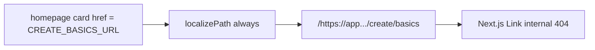
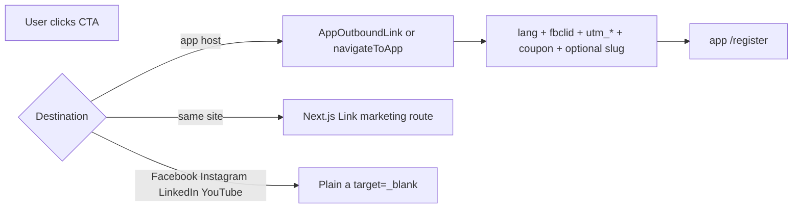

# Fix CTA destinations and add footer socials

## What is wrong today

Nav **Get your card** already goes to `{APP}/register` (`SIGNUP_URL`). Almost every other primary CTA still goes to `{APP}/create/basics` (`CREATE_BASICS_URL`).

The home **Built for every professional** carousel is worse: three cards (Agents, Small Businesses, Lawyers) store `CREATE_BASICS_URL`, then [`solutions-grid.tsx`](src/components/marketing/sections/solutions-grid.tsx) always runs `localizePath(card.href)`. [`localizePath`](src/lib/i18n/config.ts) prefixes any non-English path and forces a leading `/`, so those cards become internal URLs like `/https://app…/create/basics` (Hebrew: `/he/https://…`). [`MarketingCarouselCard`](src/components/marketing/primitives/marketing-carousel-card.tsx) then uses Next.js `<Link>` instead of `AppOutboundLink`. That is the “weird create link.”

After the fix, outbound cards skip localization and go to register via `AppOutboundLink`; in-site cards (`/solutions/freelancers`, `/solutions/agencies`) stay localized as they already do.

The broken carousel path also dropped the **app handoff**. `MarketingCarouselCard` only uses `AppOutboundLink` when `href` starts with `http`. After `localizePath`, it used Next.js `<Link>`, so `fbclid`, UTMs, `coupon`, and `lang` never reached the app, and Meta never got a `Lead` event.

## App handoff contract (marketing → app, not in-site)

Every jump **off this site onto `{APP_ORIGIN}`** must go through [`AppOutboundLink`](src/components/marketing/app-outbound-link.tsx) or [`navigateToApp`](src/lib/meta-pixel.ts) (forms). Those helpers call `withLandingAttribution` → `appendAttributionParams` + `appendLocaleParam`.

| Param | Rule | Why |
|---|---|---|
| `lang` | Current locale (`en` / `he`); never overwrite existing | App UI language |
| `fbclid` | First-touch from landing URL or sessionStorage | Meta click id across hosts |
| `utm_source/medium/campaign/content/term` | First-touch; do not overwrite if already on the target | Ads + product analytics |
| `coupon` | Last-touch from `?coupon=` / sessionStorage | Checkout promo |
| `slug` | Only if the visitor typed a handle; sanitize; **never overwrite** | Product prefills register/wizard |
| Meta events | `/register` → `Lead` (`content_category: signup`, `content_name`: placement). `/login`, `/privacy`, `/terms` → **no** conversion event (`placement={null}`). Never put slug/email/phone in event params | Accurate ads data, no PII |

**Must use the handoff (today some already do):**

- `GetCardCta` when `href` is `http(s)` — already `AppOutboundLink`
- Nav Sign in — already `AppOutboundLink` with `placement={null}`
- Pricing plan CTAs — already `AppOutboundLink` with `pricing_*` placement
- `SlugClaimCta` — already `navigateToApp`; switch URL builder only
- Home carousel outbound cards — **broken today**; restore `http` href so `AppOutboundLink` + `placement="solutions_carousel"` runs
- Footer Privacy / Terms — **gap today**: raw `<a>` + `appendLocaleParam` only. Switch to `AppOutboundLink` with `placement={null}` so `lang` plus stored `fbclid`/UTMs/`coupon` copy onto `{APP}/privacy` and `{APP}/terms` without firing Lead

**Must not use the handoff:**

- Internal marketing routes (`Link` / `localizePath`)
- Footer social icons — plain `target="_blank"` anchors. Do **not** stamp `fbclid`, UTMs, `lang`, or `coupon` onto Facebook/Instagram/LinkedIn/YouTube
- Blog share intents — already separate; leave them

`buildSignupUrl(slug?)` must set `?slug=` **before** `navigateToApp` / `AppOutboundLink` so attribution helpers can append other keys without touching `slug` (already guaranteed in [`appendAttributionParams`](src/lib/constants.ts)).

## Target destinations (per your choice)

| Control | Destination |
|---|---|
| `GetCardCta` default (final CTA, process, freelancer/agency primaries) | `SIGNUP_URL` (`/register`) |
| Home carousel outbound cards | `SIGNUP_URL` |
| Pricing plan CTAs | `SIGNUP_URL` |
| Nav Get your card | already `SIGNUP_URL` — no change |
| Nav Sign in / agency secondary | `LOGIN_URL` — no change |
| Internal carousel cards | keep `/solutions/...` |
| 404 “Back to Home” | keep `/` |
| Hero `SlugClaimCta` | `SIGNUP_URL`, plus `?slug=` when the field is filled |

**Slug risk:** the app currently prefills the handle on `/create/basics` (`useWizardSlugFromUrl`). We will still send `?slug=` on `/register` so the query is not dropped. If register ignores it, that is an `onetap-app` follow-up — marketing will not keep sending slug-claim users into the wizard.

Meta pixel already classifies `/register` as `Lead` and `/create/basics` as `InitiateCheckout` in [`classifyOutboundHref`](src/lib/meta-pixel.ts). After this change, those CTAs fire **Lead**, which matches signup-first.

## Implementation

### 1. Stop mangling absolute URLs

In [`src/lib/i18n/config.ts`](src/lib/i18n/config.ts), return `http(s)` URLs from `localizePath` unchanged.

In [`src/components/marketing/sections/solutions-grid.tsx`](src/components/marketing/sections/solutions-grid.tsx), only localize relative paths.

### 2. Point signup CTAs at register

- Default [`GetCardCta`](src/components/marketing/get-card-cta.tsx) `href` from `CREATE_BASICS_URL` → `SIGNUP_URL`.
- Replace remaining explicit create-basics CTA hrefs:
  - [`src/content/en/homepage.ts`](src/content/en/homepage.ts) + [`src/content/he/homepage.ts`](src/content/he/homepage.ts) (three carousel cards)
  - [`src/content/en/pricing.ts`](src/content/en/pricing.ts) + [`src/content/he/pricing.ts`](src/content/he/pricing.ts)
  - [`src/components/marketing/sections/process1.tsx`](src/components/marketing/sections/process1.tsx)
  - [`src/components/marketing/solutions/agency-hero.tsx`](src/components/marketing/solutions/agency-hero.tsx)
  - [`src/components/marketing/solutions/agency-workspace-simulator.tsx`](src/components/marketing/solutions/agency-workspace-simulator.tsx)
- Add `buildSignupUrl(slug?: string)` next to `buildCreateBasicsUrl` in [`src/lib/constants.ts`](src/lib/constants.ts). Point [`SlugClaimCta`](src/components/marketing/slug-claim-cta.tsx) at it.
- Keep `CREATE_BASICS_URL` / `buildCreateBasicsUrl` in constants (slug sanitization helper still useful); stop using them as marketing CTA targets.
- Update the CTA line in [`docs/component-system.md`](docs/component-system.md) so it documents `SIGNUP_URL`, not create-basics.

### 3. App handoff on remaining app-host links

In [`src/components/layout/footer.tsx`](src/components/layout/footer.tsx), replace raw `<a href={appendLocaleParam(PRIVACY_URL|TERMS_URL)}>` (column + bottom bar) with `AppOutboundLink` and `placement={null}`. Keep `target="_blank"` / `rel="noopener noreferrer"` if we still want a new tab; if `AppOutboundLink` always does `window.location.assign`, match existing new-tab behavior by extending it only if needed — privacy/terms already open in a new tab, so prefer an optional `target` on `AppOutboundLink` rather than losing that, while still running `navigateToApp` on click for the same-tab case.

Audit: no leftover `https://app…` or `CREATE_BASICS_URL` CTA that bypasses `AppOutboundLink` / `navigateToApp`.

### 4. Footer socials

Add canonical profile URLs in [`src/lib/constants.ts`](src/lib/constants.ts) (same pattern as `LOGIN_URL`):

- Facebook: `https://www.facebook.com/profile.php?id=61586661953454`
- Instagram: `https://www.instagram.com/onetap_card/` (same handle you gave; Instagram is case-insensitive)
- LinkedIn: `https://www.linkedin.com/company/onetap-card/` — drop `/home/?viewAsMember=true` (that is an admin view, not the public company page)
- YouTube: `https://www.youtube.com/@ONETAP-CARD`

Place a row of icon buttons under the footer blurb in [`src/components/layout/footer.tsx`](src/components/layout/footer.tsx): circular, `text-brand-cream/60` → hover turquoise, `target="_blank"` + `rel="noopener noreferrer"`. Use Tabler brand icons (`IconBrandFacebook` / `Instagram` / `Linkedin` / `Youtube`) to match existing social usage in [`blog-share.tsx`](src/components/marketing/blog/blog-share.tsx). These are **not** `AppOutboundLink`.

Add EN + HE aria labels in [`src/content/en/chrome.ts`](src/content/en/chrome.ts) and [`src/content/he/chrome.ts`](src/content/he/chrome.ts).

Add those four URLs as Organization `sameAs` in [`src/lib/seo/json-ld.ts`](src/lib/seo/json-ld.ts) (already called out as the next step in [`docs/guides/marketing-seo-geo.md`](docs/guides/marketing-seo-geo.md)).

### 5. Verify

Browser (EN + HE home) with a query like `?fbclid=test123&utm_source=meta&utm_campaign=audit&coupon=SAVE10`:

- Carousel Agents/SMB/Lawyers → `{APP}/register?…` including `lang`, `fbclid`, UTMs, `coupon` (not a mangled `/https://…` path)
- Freelancers/Creators/Agencies stay on marketing routes (no app query params)
- Nav Get your card / Sign in: register vs login, both with the same param set; login does not fire Lead
- Slug submit → `/register?slug=…` plus attribution params; `slug` unchanged
- Footer Privacy/Terms → app URLs with `lang` + attribution, not Lead
- Footer socials open the four profiles with **clean** URLs (no `fbclid`/`lang`/`coupon`)

Then: `npm run check:i18n-rtl`, `npm run typecheck`, `npm run lint`, `npm run build`.

Then: `npm run check:i18n-rtl`, `npm run typecheck`, `npm run lint`, `npm run build`.

No public routes added/removed — sitemap / `llms.txt` unchanged. Persist the approved plan under `docs/plans/2026-09-15-cta-destinations-and-footer-social.md`.
