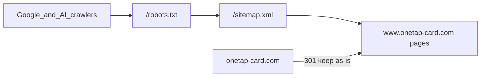
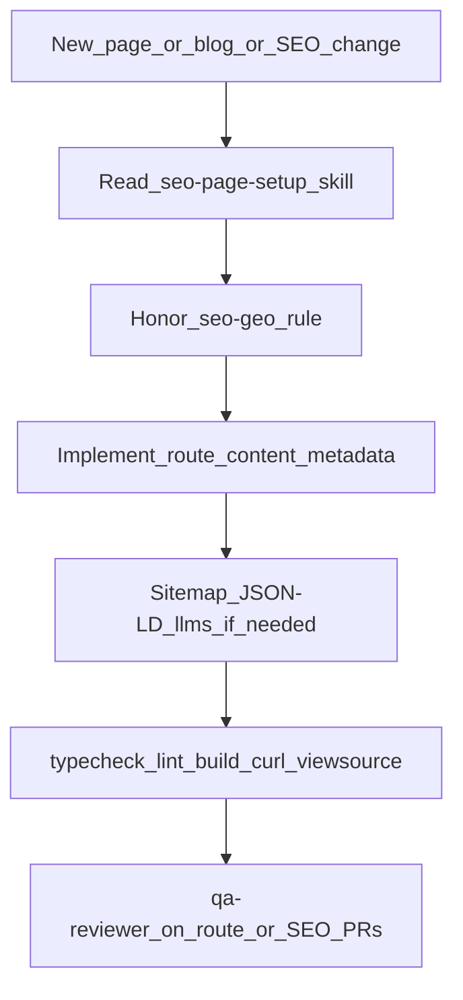

# SEO + GEO foundation (www, robots, structured data)

## What is already true

Marketing’s brief is mostly **cleanup + alignment**, not a missing sitemap.

- [`src/app/sitemap.ts`](src/app/sitemap.ts) already generates `/sitemap.xml` with the 7 public marketing routes × EN/HE plus **18 blog posts × 2 locales ≈ 50 URLs**. That matches GSC’s “~50 pages.”
- Canonical tags, Open Graph URLs, and `metadataBase` all go through [`getSiteUrl()`](src/lib/site-url.ts).
- hreflang (`en`, `he`, `x-default`) is already on pages and in the sitemap via [`getLocaleAlternates()`](src/lib/i18n/config.ts).
- FAQ JSON-LD already exists on [`src/app/[locale]/faq/page.tsx`](src/app/[locale]/faq/page.tsx).
- Middleware already lets `/sitemap.xml` and `/robots.txt` through ([`src/middleware.ts`](src/middleware.ts)).

The actual production bugs:

1. **Canonical host is the apex.** `DEFAULT_SITE_URL` is `https://onetap-card.com` (also CI, `.env.example`, docs). Live traffic 301s to `https://www.onetap-card.com/`, so sitemap + canonical + OG currently advertise **redirecting URLs**. That is the GSC “Page with redirect” class of issue.
2. **There is no `robots.ts` or `public/robots.txt`**, so `/robots.txt` 404s.

We will **not** commit a static `public/sitemap.xml`. A hand-maintained XML file would go stale the next time a blog post is added. Public URLs stay `/sitemap.xml` and `/robots.txt`; marketing’s HTTP acceptance criteria still pass.

## Slice 1 — Canonical www (the real GSC fix)

Change the default origin to `https://www.onetap-card.com` and keep a single helper as the source of truth.

- Update [`src/lib/site-url.ts`](src/lib/site-url.ts) `DEFAULT_SITE_URL`.
- Update [`.env.example`](.env.example), [`docs/engineering/environment-variables.md`](docs/engineering/environment-variables.md), [`docs/engineering/seo-checklist.md`](docs/engineering/seo-checklist.md), [`AGENTS.md`](AGENTS.md), and [`.github/workflows/quality-gates.yml`](.github/workflows/quality-gates.yml).
- Point leftover apex fallbacks in [`src/lib/constants.ts`](src/lib/constants.ts) (`appendAttributionParams` / `appendLocaleParam` URL bases) at `getSiteUrl()` so share/CTA URL construction cannot emit mixed hosts.
- **Human/ops step (required for production):** set Vercel Production `NEXT_PUBLIC_SITE_URL=https://www.onetap-card.com` and rebuild. Code default is the safety net; env wins if set.

Do **not** reverse the apex→www 301. GSC is already on that redirect.

## Slice 2 — `robots.ts` (Next.js MetadataRoute)

Add [`src/app/robots.ts`](src/app/robots.ts):

- Production: `User-agent: *` + `Allow: /` + `Sitemap: https://www.onetap-card.com/sitemap.xml`.
- Also emit explicit `Allow: /` for citation/training crawlers used in GEO audits: `GPTBot`, `ChatGPT-User`, `Google-Extended`, `ClaudeBot`, `PerplexityBot`, `Applebot-Extended`. Redundant with `*`, but makes policy obvious in SEO audits.
- Preview (`VERCEL_ENV === "preview"`): `Disallow: /` and **no sitemap**. Stops Google indexing `*.vercel.app` duplicates.

This is the same public URL marketing asked for (`/robots.txt`, `200`, `text/plain`). No dashboard/login routes exist in this repo (app lives on `app.onetap-card.com`), so we will not invent `Disallow` rules for `/dashboard` etc.

## Slice 3 — Sitemap quality (keep the generator)

Keep [`src/app/sitemap.ts`](src/app/sitemap.ts). Changes:

- Continue listing only the current public set: `/`, `/pricing`, `/faq`, `/solutions`, `/solutions/freelancers`, `/solutions/agencies`, `/blog`, plus all live blog slugs in both locales. No private/app URLs.
- **Blog `lastModified`:** keep `post.date` (already correct).
- **Static routes:** stop using `new Date()` on every build (fake lastmod). Omit `lastModified` for those entries unless we later add real content dates.
- Keep `changefreq` / `priority` as marketing requested (Google largely ignores them; they do not hurt).
- Keep hreflang `alternates.languages` (better than the brief’s simple `<urlset>`).

## Slice 4 — Structured data (legacy search + AI extraction)

Add a small JSON-LD helper (e.g. [`src/lib/seo/json-ld.ts`](src/lib/seo/json-ld.ts) + a tiny `<JsonLd />` server component) and reuse it from FAQ.

| Surface | Schema | Why |
|---|---|---|
| Site-wide (locale layout or shared chrome) | `Organization` + `WebSite` | Entity for Google/Bing and AI answer engines |
| Home / product-ish pages | `SoftwareApplication` (web app, offers → `/pricing`) | Product understanding without inventing a CMS |
| Blog posts | `BlogPosting` (headline, datePublished, author, image, canonical) | Article rich results + citation snippets |
| Nested pages (solutions/*, blog) | `BreadcrumbList` | Hierarchy in SERPs |
| `/faq` only | keep existing `FAQPage` | Already live; do **not** duplicate on homepage |

Do **not** invent `sameAs` social profiles — the footer has none. If marketing later supplies LinkedIn/Instagram/X URLs, they drop into Organization `sameAs`.

Use `getSiteUrl()` for every `@id` / `url` so schema stays on www.

## Slice 5 — GEO: `/llms.txt` + preview noindex

- Add [`src/app/llms.txt/route.ts`](src/app/llms.txt/route.ts) (`text/plain`) with a short English brand brief: what OneTap is, who it is for, canonical www URLs for home/pricing/solutions/faq/blog, and a note that Hebrew lives under `/he`. This is the emerging “AI sitemap” crawlers (and some GEO auditors) look for.
- Allow `/llms.txt` in [`src/middleware.ts`](src/middleware.ts) the same way as robots/sitemap.
- Add `robots: { index: false, follow: false }` in root metadata when `VERCEL_ENV === "preview"` so leaked preview URLs do not compete with www.

## Slice 6 — Docs + changelog

- Tick robots + JSON-LD in [`docs/engineering/seo-checklist.md`](docs/engineering/seo-checklist.md); expand it so it mirrors Slice 7 non-negotiables (www host, metadata routes, schema, `llms.txt`, preview noindex, bilingual).
- Persist this plan as [`docs/plans/2026-09-15-seo-geo-foundation.md`](docs/plans/2026-09-15-seo-geo-foundation.md) on implement (include the orchestration section, not only the code slices).
- Append two lines to [`.cursor/history/CHLOG-AI.md`](.cursor/history/CHLOG-AI.md) (public SEO/robots/canonical posture **and** the new agent standard).

## Slice 7 — AI orchestration standard (keep this bar on later work)

This slice is as important as robots.txt. A one-off GSC fix will rot the first time someone adds a page and forgets sitemap, canonical, schema, or `/llms.txt`. The repo already orchestrates work through **rules (laws) → skills (workflows) → review agents (no implementation)**. SEO/GEO must live in that same stack so future Cursor sessions do not treat discoverability as optional polish.

### Why this matters (read this before skipping SEO on a “small” PR)

- **Legacy search (Google/Bing):** ranking needs one canonical host (`www`), indexable public URLs only, unique titles/descriptions, and a sitemap that lists the **final** URLs — not redirects. Duplicate hosts and missing robots files create GSC noise and wasted crawl budget.
- **AI search / GEO (ChatGPT, Perplexity, Gemini, Google AI Overviews):** answer engines cite pages they can fetch, parse, and attribute. They lean on clear entity data (JSON-LD), a stable brand URL, `llms.txt`, and crawl permission. Blocking or starving those crawlers means OneTap disappears from answers even if Google classic still ranks.
- **Bilingual EN/HE:** every public English URL has a Hebrew twin (`/he/...`) with hreflang + `x-default`. Shipping one locale is an incomplete page.
- **Previews vs production:** Vercel preview URLs must stay `noindex`. Indexing them splits ranking signals away from `www.onetap-card.com`.

Skipping this layer is not “shipping faster.” It is training search and AI systems on the wrong host, the wrong URLs, or no structured facts.

### Non-negotiables (the standard)

1. **One origin.** All canonicals, sitemap locs, OG `url`, JSON-LD `url`/`@id`, and `Sitemap:` in robots use `getSiteUrl()` → production `https://www.onetap-card.com`. Never hardcode `https://onetap-card.com` in new UI or metadata.
2. **Dynamic discovery files.** `/sitemap.xml` comes from [`src/app/sitemap.ts`](src/app/sitemap.ts); `/robots.txt` from [`src/app/robots.ts`](src/app/robots.ts). Do **not** add stale `public/sitemap.xml` / `public/robots.txt`.
3. **Public pages are discoverable.** New indexable routes: unique metadata via `buildLocaleMetadata` (or the blog equivalent), both locales, sitemap static-route entry (blog slugs stay automatic via `getAllSlugs()`), JSON-LD that matches **visible** copy.
4. **Private/app surfaces stay out.** Dashboard, billing, editor, login live on the app host. Do not add them to the marketing sitemap or invent `Disallow` paths that do not exist here.
5. **GEO files stay truthful.** If you add/remove a major public landing, update `/llms.txt` in the same PR. Do not let `llms.txt` advertise dead URLs.
6. **Preview never competes.** Do not weaken preview `Disallow` / `noindex` to “test SEO on a preview URL.” Inspect production (or local `next start` with www `NEXT_PUBLIC_SITE_URL`).

### How later implementations should run (agent orchestration)

**Playbook by change type** (encode this in skills, not only in this plan):

- **New marketing/solutions page:** follow `marketing-page-delivery` **and** `seo-page-setup`. Must include: EN+HE copy, `buildLocaleMetadata`, sitemap static path, breadcrumbs JSON-LD if nested, mention in `/llms.txt` if it is a primary landing (home/pricing/solutions/faq/blog-level).
- **New blog post:** follow `blog-content-authoring`. Sitemap is automatic; still require unique title/excerpt, `BlogPosting` (from the shared helper), both locales, real `date`. Do not leave Hebrew unpublished if English is live.
- **Copy-only tweak on an existing URL:** metadata/JSON-LD must still match the new visible text (especially FAQ answers). No sitemap change.
- **New public file for crawlers** (`llms.txt`, future `llms-full.txt`): add a middleware passthrough next to robots/sitemap; return the correct `Content-Type`; use `getSiteUrl()` in the body.
- **Legal/product change to AI crawling:** only edit [`src/app/robots.ts`](src/app/robots.ts). Default remains **allow** citation crawlers. Blocking GPTBot/Claude/Perplexity is an explicit legal decision, not a drive-by.

**When to invoke reviewers:** on PRs that add routes, change `getSiteUrl` / robots / sitemap / JSON-LD / `llms.txt`, run `@qa-reviewer` (discoverability + orphans). Use `@architect-reviewer` if the change adds a new public route family or a new crawler file type.

### Files to add or update so the standard actually loads

- **New rule** [`.cursor/rules/seo-geo-standard.mdc`](.cursor/rules/seo-geo-standard.mdc) — globs: `src/app/**`, `src/app/sitemap.ts`, `src/app/robots.ts`, `src/lib/site-url.ts`, `src/lib/seo/**`, `src/lib/i18n/metadata.ts`. Laws: www via `getSiteUrl()`, no static public sitemap/robots, JSON-LD matches visible copy, both locales, update `llms.txt` for primary landings, preview noindex stays on.
- **Upgrade skill** [`.cursor/skills/seo-page-setup/SKILL.md`](.cursor/skills/seo-page-setup/SKILL.md) — rename the mental model to SEO+GEO: read the guide + checklist first; www check; sitemap; JSON-LD type to emit; `llms.txt` if primary landing; robots only if crawl policy changes. Expand the output template with canonical host, schema types, and GEO notes.
- **New guide** [`docs/guides/marketing-seo-geo.md`](docs/guides/marketing-seo-geo.md) — short “why + how” for humans and agents: SEO vs GEO, canonical www, discovery files, schema map, bilingual, preview vs prod, and a “do not regress” list. This is the orchestration note future sessions should cite instead of re-deriving the GSC brief.
- **Point the map:** [`project-index.mdc`](.cursor/rules/project-index.mdc) (`src/app/**`, sitemap, robots, `src/lib/seo/**` → seo-geo rule + seo-page-setup skill + the guide). [`AGENTS.md`](AGENTS.md) SEO playbook: default host is www; robots/sitemap are metadata routes; link the guide.
- **Downstream playbooks:** add a “SEO/GEO gate” checkbox to [`marketing-page-delivery/SKILL.md`](.cursor/skills/marketing-page-delivery/SKILL.md) and [`blog-content-authoring/SKILL.md`](.cursor/skills/blog-content-authoring/SKILL.md) (sitemap/schema/locales/`llms.txt` as applicable).
- **Review agent:** extend [`.cursor/agents/qa-reviewer.md`](.cursor/agents/qa-reviewer.md) to flag: apex URLs, missing sitemap entries, missing JSON-LD on new public pages, `llms.txt` drift, preview indexable, Hebrew URL missing.
- **Keep [`seo-metadata.mdc`](.cursor/rules/seo-metadata.mdc)** as the thin per-route metadata rule; it should defer host/robots/GEO laws to `seo-geo-standard.mdc` so we do not duplicate conflicting defaults.

## Verification

- `npm run typecheck && npm run lint && npm run build`
- After build, confirm `.next` serves `/robots.txt` and `/sitemap.xml` (local `next start` + curl): `200`, `text/plain` / XML, **only** `https://www.onetap-card.com/...` locs.
- Browser: homepage, `/he`, a blog post, `/faq` — view-source for canonical, hreflang, JSON-LD, no preview noindex on local prod-like start.
- Post-deploy (marketing / you): resubmit `https://www.onetap-card.com/sitemap.xml` in GSC; URL Inspection on the www homepage.

## Out of this PR (follow-up roadmap, not blocked)

These move ranking more than another robots tweak, once the technical layer is clean. Later work still follows Slice 7 (same host, sitemap, schema, locales, `llms.txt`).

- **Content/GEO:** comparison/“vs paper card” landing beyond the existing blog; more vertical solution pages; author bios (E-E-A-T) instead of only “OneTap Team.”
- **Bing Webmaster + IndexNow** after www is stable in GSC.
- **Organization `sameAs`** when marketing provides official social URLs.
- Optional `llms-full.txt` if they want a longer AI-readable digest of blog titles. Update the GEO guide when any of these land so the standard stays current.

## Risk notes

- Wrong Vercel `NEXT_PUBLIC_SITE_URL` (left on apex) would **override** the new default. Call this out in the PR.
- JSON-LD must match visible copy (especially FAQ). Homepage FAQ stays **without** FAQPage schema to avoid two competing FAQ graphs.
- Explicit AI-bot `Allow` is a product choice: this site **wants** citations. If legal later wants to block training crawlers, that is a one-file robots change.
